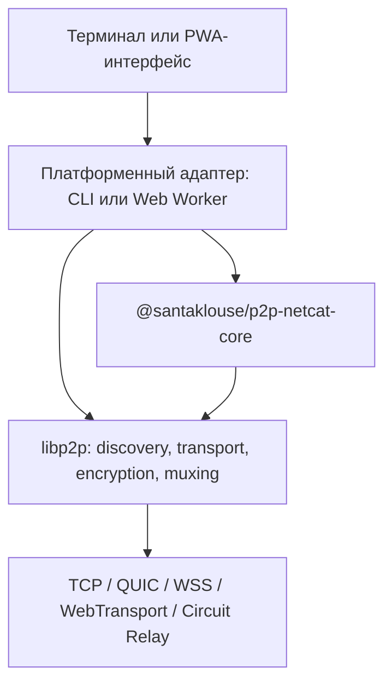
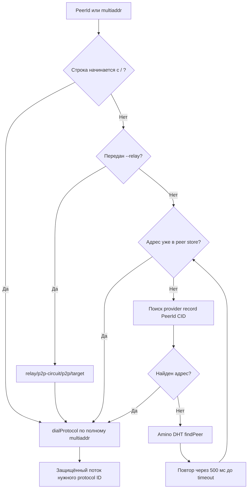
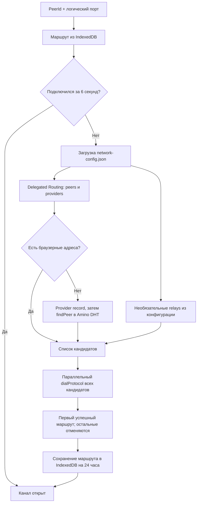

# Архитектура и алгоритм работы p2p-netcat

[English](ARCHITECTURE.md) | **Русский**

Этот документ подробно описывает текущее устройство `p2p-netcat`: общую
JavaScript-библиотеку, CLI, браузерный PWA-клиент, поиск узла по `PeerId`, выбор
маршрута, установление защищённого потока и обработку данных. Это описание
существующей реализации, а не список будущих возможностей.

## 1. Задача проекта

Обычный `netcat` подключается к паре `IP-адрес:порт`. `p2p-netcat` заменяет
сетевой адрес постоянной криптографической идентичностью:

```text
PeerId + логический порт
```

Например, логический порт `31337` не является TCP- или UDP-портом операционной
системы. Он преобразуется в имя libp2p-протокола:

```text
/p2p-netcat/1.0.0/31337
```

`PeerId` отвечает на вопрос «с каким криптографическим узлом соединиться», а
multiaddr отвечает на вопрос «каким сетевым маршрутом до него добраться».
Поэтому знать один `PeerId` достаточно только тогда, когда discovery-система
может найти хотя бы один актуальный и доступный текущему клиенту multiaddr.

## 2. Слои системы



### Общая библиотека

Пакет `@santaklouse/p2p-netcat-core` не использует Node.js API и содержит
правила, которые должны одинаково работать в CLI и браузере:

- проверка логического порта;
- построение protocol ID;
- нормализация `PeerId` и multiaddr;
- проверка WS/WSS relay-адресов;
- построение Circuit Relay dial plan;
- определение пригодности адреса для браузера;
- единый рейтинг транспортов.

Библиотека намеренно не создаёт libp2p-узел, не обращается к DHT, не работает с
файловой системой и не управляет Web Worker. Это функции платформенных слоёв.

### CLI

CLI отвечает за постоянные ключи, stdin/stdout, запуск дочерней команды,
создание Node.js libp2p-узла, mDNS, Amino DHT, TCP, QUIC и relay-режим.

### Браузерный клиент

React отвечает только за интерфейс. Сетевой libp2p-узел работает в отдельном
Web Worker, поэтому поиск маршрутов, шифрование и передача больших блоков не
занимают главный UI-поток. Service Worker не передаёт P2P-трафик: он кеширует
статическую оболочку PWA и обслуживает её обновления.

## 3. Идентичность и PeerId

### Постоянная серверная идентичность

CLI-слушатель загружает Ed25519-ключ из
`~/.config/p2p-netcat/identity.key`. Если файла нет, он:

1. создаёт каталог конфигурации с правами `0700`;
2. генерирует Ed25519-ключ;
3. сохраняет сериализованный приватный ключ с правами `0600`;
4. вычисляет `PeerId` из публичной части ключа.

Следующий запуск с тем же файлом получает тот же `PeerId`. Удаление или замена
ключа меняет идентичность узла. Команда `p2p-nc id` показывает PeerId без
запуска слушателя.

### Клиентская идентичность

CLI-клиент без `--identity` генерирует временный ключ на каждый запуск. При
передаче `--identity` его PeerId становится постоянным. Браузерный клиент в
текущей реализации также создаёт идентичность при запуске Worker и не сохраняет
приватный ключ между сессиями.

## 4. Создание libp2p-узла CLI

`createP2PNode()` собирает узел из следующих компонентов:

| Назначение | Реализация |
|---|---|
| Прямые транспорты | QUIC v1 и TCP |
| Браузерный/relay транспорт | WebSocket и Circuit Relay v2 |
| Шифрование | Noise; QUIC дополнительно использует TLS 1.3 транспортного уровня |
| Мультиплексирование | Yamux |
| LAN discovery | mDNS |
| Internet discovery | подписанный GossipSub + bootstrap + IPFS Amino DHT |
| Служебные протоколы | identify и ping |

По умолчанию CLI слушает IPv4 и IPv6 на QUIC и TCP. Значение
`--transport-port 0` означает, что операционная система выберет свободные
транспортные порты. `-4`, `-6` и `--no-quic` изменяют набор listen-адресов.

Если явно переданы relay-адреса, узел добавляет listen-адреса вида
`relay/p2p-circuit`. Без явного relay он добавляет `/p2p-circuit`, позволяя
libp2p запросить автоматическую reservation у подходящего подключённого узла.
Наличие такой reservation не гарантируется публичной IPFS-сетью.

## 5. Алгоритм CLI-слушателя

При запуске `p2p-nc -l 31337` выполняются следующие шаги:

1. Проверяется диапазон логического порта `1..65535`.
2. Загружается или создаётся постоянный Ed25519-ключ.
3. Создаётся libp2p-узел в server mode DHT.
4. Регистрируется обработчик протокола
   `/p2p-netcat/1.0.0/31337`.
5. В `stderr` печатаются PeerId, доступные multiaddr и путь к ключу.
6. Параллельно запускается публикация provider record для CID собственного
   PeerId в Amino DHT.
7. При входящем потоке libp2p уже проверил криптографическую идентичность
   удалённого узла; поток подключается к stdin/stdout или к команде из `-e`.
8. Без `-k` слушатель завершается после первого сеанса. С `-k` продолжает
   принимать следующие подключения.

Публикация в DHT имеет таймаут 60 секунд. При ошибке выполняется повтор через
5 секунд. После успешной публикации запись обновляется каждые 6 часов, пока
слушатель работает.

Provider record использует CID, полученный из PeerId. При поиске клиент
принимает только provider, чей идентификатор точно совпадает с запрошенным
PeerId. Окончательная проверка личности всё равно происходит во время
защищённого libp2p-handshake.

## 6. Алгоритм CLI-клиента

Входом служит `PeerId` или полный multiaddr и логический порт.



Детали алгоритма:

1. Полный multiaddr используется непосредственно и пропускает discovery.
2. Если указан `--relay`, первый relay из списка немедленно превращается в
   `relay/p2p-circuit/p2p/targetPeerId`.
3. Иначе сначала проверяется локальный peer store. Он мог получить адрес через
   mDNS, подписанный GossipSub, bootstrap, identify или предыдущий запрос.
4. Затем до 4 секунд ищется provider record для CID целевого PeerId.
5. Если provider record не дал адрес, до 4 секунд выполняется `findPeer`.
6. Цикл повторяется каждые 500 мс до общего `-w`; по умолчанию это 60 секунд.
7. После разрешения адреса вызывается `dialProtocol()` с protocol ID выбранного
   логического порта.

Приоритет адресов в общем core-пакете: WebRTC Direct, QUIC v1, WebTransport,
WSS, WS, TCP, прочие адреса и последним Circuit Relay. Конкретная платформа
может использовать только поддерживаемое ею подмножество.

## 7. Алгоритм браузерного клиента

### Запуск

Страница создаёт module Web Worker и общается с ним RPC-сообщениями `start`,
`connect`, `send`, `closeWrite` и `stop`. Бинарные `ArrayBuffer` передаются как
transferable objects без дополнительного копирования между UI и Worker.

Worker создаёт libp2p-узел без listen-адресов со следующими транспортами:

- WebTransport;
- WebSocket;
- Circuit Relay v2.

В Worker также работают Noise, Yamux, identify, ping, подписанный GossipSub
Peer Discovery, bootstrap discovery и Amino DHT в client mode.

### Автоматический поиск маршрута

Если ручное поле relay пустое, применяется следующий порядок:



Полная последовательность:

1. Проверяется кеш `p2p-netcat-network/routes` в IndexedDB. Записи старше
   24 часов игнорируются.
2. Кешированный адрес получает 6 секунд на подключение. Ошибка не завершает
   операцию, а запускает новый поиск.
3. Пока остальные ветки поиска работают, GossipSub принимает корректные
   объявления p2p-netcat и добавляет их адреса в peer store.
4. Worker загружает статический `network-config.json`. При недоступности файла
   используется встроенная конфигурация.
5. Для каждого delegated routing endpoint запрашиваются оба ресурса:
   `peers/{PeerId}` и `providers/{PeerId-CID}`. Эти HTTP-запросы выполняются
   параллельно, каждый имеет таймаут 8 секунд.
6. Если delegated routing не вернул подходящих адресов, сначала проверяется
   peer store, затем запускается Amino DHT: provider lookup и `findPeer` с
   повтором до 20 секунд.
7. Из результатов удаляются адреса, которые браузер не может набрать. Сейчас
   остаются WebTransport и WS/WSS; HTTPS-страница принимает только защищённый
   WSS. TCP и обычный QUIC браузеру недоступны.
8. К адресам discovery добавляются необязательные relay из статической
   конфигурации.
9. Для каждого кандидата одновременно вызывается `dialProtocol()`. Первый
   успешный поток побеждает, остальные попытки отменяются через AbortController.
10. Победивший multiaddr сохраняется в IndexedDB и первым проверяется в
   следующей сессии.

Delegated Routing и DHT являются последовательными fallback-уровнями. Именно
проверка нескольких найденных multiaddr выполняется параллельно.

Параллельно со всей libp2p-веткой запускается Trystero/WebRTC. Сервер и клиент
входят в детерминированную room из `PeerId + логический порт`, используя
публичные WebTorrent trackers только для SDP/ICE signaling. До допуска канала
к данным клиент отправляет случайный 32-байтовый challenge. CLI-сервер подписывает
domain-separated transcript постоянным Ed25519-ключом; клиент проверяет подпись
и выводит PeerId из переданного публичного ключа. Первый успешно
аутентифицированный libp2p или WebRTC-канал отменяет проигравшую попытку.

Оба адаптера Trystero получают ICE-конфигурацию из общего core-пакета. В неё
входят девять `stun:` URL: пять endpoint Google, а также CounterPath, Sipgate,
VoIPBuster и InternetCalls. STUN сообщает WebRTC публичный NAT mapping; данные
p2p-netcat через STUN-сервер не передаются.

### Модель PubSub discovery

CLI-узлы, relay и браузерный Worker подписываются на тему
`io.github.santaklouse.p2p-netcat.peer-discovery.v1`. Каждые десять секунд
`@libp2p/pubsub-peer-discovery` публикует публичный ключ узла и текущие
multiaddr. GossipSub по умолчанию использует `StrictSign`. Получатель вычисляет
объявленный PeerId из вложенного публичного ключа, а GossipSub envelope
аутентифицирует издателя. Discovery всё равно не является источником доверия:
злоумышленник может объявить неработающий маршрут, но перед открытием потока
финальный Noise/QUIC handshake обязан доказать владение запрошенным PeerId.

PubSub является дополнительной веткой, а не самостоятельным bootstrap. Он не
подключает полностью изолированный узел и не гарантирует глобальный поиск:
объявление распространяется только через уже подключённых подписчиков той же
темы. Публичные IPFS bootstrap-узлы не обязаны передавать тему приложения.
Опция `--no-pubsub` отключает эту ветку. Relay p2p-netcat участвует по умолчанию
и может передавать объявления между уже подключёнными клиентами.

### Ручной relay

Если пользователь раскрыл дополнительные настройки и ввёл relay multiaddr,
автоматический discovery пропускается. Core-пакет проверяет, что адрес:

- содержит `/p2p/PeerId` relay-узла;
- содержит `/ws` или `/wss`;
- для HTTPS-страницы использует защищённый WSS.

Затем строится адрес:

```text
/dns4/relay.example/tcp/443/wss/p2p/12D3KooWEqeQRAJ61HSv9yMPk8yzjke7NxmTFcvFt4GzwXxzVjXW/p2p-circuit/p2p/12D3KooWQ3uxpHgjDKE6vGmvzKS8RPbxUDLwJ7XCLaD6YXdUfbR9
```

Ручной адрес является явным override и нужен, когда discovery видит только
TCP/QUIC-адреса сервера или публичная сеть не предоставляет пригодный relay.

## 8. Статическая сетевая конфигурация браузера

Файл `web/public/network-config.json` входит в статическую сборку:

```json
{
  "delegatedRouting": [
    "https://delegated-ipfs.dev/routing/v1"
  ],
  "relays": []
}
```

`delegatedRouting` содержит HTTP Routing V1 endpoints. `relays` может содержать
пул WSS Circuit Relay multiaddr. Пустой список означает, что скрытый relay не
навязывается и клиент сначала полагается на discovery.

Изменение этого JSON не требует серверного JavaScript. На GitHub Pages файл
остаётся обычным статическим ресурсом и попадает в PWA precache.

## 9. Установление защищённого канала

Discovery-службы возвращают только маршрут. Они не считаются источником
доверия к содержимому канала.

1. Клиент набирает multiaddr выбранным транспортом.
2. libp2p выполняет защищённый handshake.
3. Удалённая сторона доказывает владение приватным ключом целевого PeerId.
4. При несовпадении PeerId соединение отклоняется.
5. Yamux создаёт мультиплексированный поток с protocol ID логического порта.
6. Сервер принимает поток только при зарегистрированном protocol ID.

При прямом QUIC транспорт защищён QUIC TLS 1.3. Для остальных libp2p-соединений
используется Noise. Circuit Relay переносит уже защищённый поток: relay видит
PeerId, адреса, время и объём трафика, но не прикладные байты.

Это не скрывает метаданные и не делает discovery анонимным. Delegated Routing,
DHT-узлы и relay могут наблюдать факт поиска или соединения.

## 10. Передача данных и EOF

После открытия потока протокол не добавляет сообщений, строковых разделителей
или JSON-обёрток. Передаются исходные байты.

CLI одновременно запускает два асинхронных направления:

- stdin → libp2p stream;
- libp2p stream → stdout.

Если `stream.send()` сообщает о заполнении буфера, отправитель ждёт
`stream.onDrain()`. При записи в Node.js output учитывается событие `drain`.
Это обеспечивает backpressure и не требует загружать весь файл в память.

EOF stdin закрывает пишущую сторону потока после необязательной задержки
`--quit-delay`.
Получение продолжается до закрытия удалённой стороной. Явно переданный `-w`
также становится таймаутом простоя; любое движение данных перезапускает таймер.

В браузере текст кодируется через UTF-8 `TextEncoder`. Файл читается потоково
через `file.stream()`, а каждый блок передаётся Worker. Команда «Отправить EOF»
закрывает запись, не запрещая принимать оставшиеся данные.

Режимы в стиле gs-netcat работают как адаптеры над тем же аутентифицированным
потоком. Клиентский `-p` создаёт локальный TCP listener и открывает отдельный
P2P-поток для каждого сокета. Listener `-d/-p` соединяет поток с TCP-целью, а
`-S` сначала разбирает SOCKS4/4a/5 request. Интерактивный `-i` кадрирует данные
PTY и изменение размера окна, а `node-pty` управляет псевдотерминалом сервера.
Tor `-T` отключает прямые и UDP/discovery-маршруты и повторно запускает
relay-only клиент через `torsocks`.

## 11. Режим выполнения команды

В `p2p-nc -l -e 'command'` входящий P2P-поток подключается к stdin дочернего
процесса, а его stdout и stderr объединяются и отправляются клиенту. Команда
запускается через системную shell.

Этот режим предоставляет удалённой стороне возможности локального процесса.
В текущей версии нет allowlist PeerId, интерактивного подтверждения или
песочницы. Использовать `-e` безопасно только с доверенным PeerId и в отдельно
изолированном окружении.

## 12. Relay-режим

`p2p-nc relay` запускает Circuit Relay v2 server с постоянным отдельным ключом.
По умолчанию он слушает TCP/QUIC на порту `9090` и WebSocket на `9091`.
Он также участвует в PubSub discovery mesh; это можно отключить через
`--no-pubsub` или `enablePubsub: false` в программном API.

Текущие ограничения одной reservation:

- срок до 2 часов;
- объём до 128 MiB;
- одновременно до 128 reservations;
- общий лимит соединений relay-узла — 512.

Для браузера незашифрованный `/ws` подходит только на localhost или для
не-HTTPS контекста. GitHub Pages работает по HTTPS, поэтому публичный relay
нужно выставить как `/wss`, обычно через TLS reverse proxy.

## 13. PWA и офлайн-режим

Vite собирает статические HTML, CSS, JavaScript, module Worker, manifest,
изображения и `network-config.json`. Workbox Service Worker:

- удаляет устаревшие кеши;
- активирует новую версию без ручной перезагрузки Service Worker;
- кеширует статические ресурсы приложения;
- использует Network First для навигации с трёхсекундным сетевым таймаутом.

«Офлайн» здесь означает, что интерфейс может открыться из кеша. Для P2P-поиска
и соединения всё равно нужна сеть, если целевой узел не доступен локально.

## 14. Ошибки и fallback

| Ситуация | Поведение |
|---|---|
| PeerId имеет неверный формат | Ошибка до сетевого подключения |
| Логический порт вне `1..65535` | Ошибка в общей библиотеке |
| CLI получил полный multiaddr | Discovery пропускается |
| CLI не нашёл PeerId до `-w` | Предлагается передать relay или полный multiaddr |
| Кеш браузера устарел | Кеш отклоняется, запускается discovery |
| `network-config.json` недоступен | Используется встроенный endpoint |
| Delegated Routing не дал адрес | Запускается Amino DHT |
| Найдены только TCP/QUIC адреса | Браузер их отбрасывает |
| Один browser-кандидат не отвечает | Остальные параллельные попытки продолжаются |
| Все browser-кандидаты отклонены | Показывается ошибка и предложение указать relay |
| UDP заблокирован для CLI | При известном TCP-адресе libp2p может подключиться по TCP |

## 15. Что означает «подключение только по PeerId»

PeerId не содержит текущий IP-адрес. Поэтому абсолютная гарантия нахождения
двух произвольных компьютеров только по PeerId невозможна без доступного канала
сигналинга, DHT/provider record, rendezvous-службы или заранее известного relay.

Текущая реализация скрывает эту сложность от обычного сценария:

- LAN: mDNS;
- CLI через интернет: provider record и Amino DHT;
- CLI, relay и браузер: подписанный GossipSub через уже доступную mesh;
- браузер: кеш, GossipSub, Delegated Routing, затем Amino DHT;
- CLI и браузер: параллельный Trystero/WebRTC через WebTorrent signaling;
- NAT/CGNAT: Circuit Relay v2;
- точная диагностика: полный multiaddr или ручной relay.

Если сервер недоступен, выключен, не опубликовал актуальный адрес или находится
за NAT без рабочей reservation, один PeerId не может создать маршрут сам по
себе.

## 16. Карта исходного кода

| Файл | Ответственность |
|---|---|
| `packages/core/src/index.js` | Валидация, protocol ID, relay dial plan, PubSub/STUN-конфигурация |
| `src/identity.js` | Создание и загрузка Ed25519-ключа CLI |
| `src/node.js` | Сборка Node.js libp2p-узла и подписанного PubSub discovery |
| `src/relay.js` | Публичный API жизненного цикла `@santaklouse/p2p-netcat/relay` |
| `src/discovery.js` | DHT-публикация и разрешение PeerId CLI |
| `src/forwarding.js` | TCP forwarding, SOCKS4/4a/5 и локальные listeners |
| `src/pty.js` | PTY framing, raw client и login shell |
| `src/session.js` | Двунаправленный поток, backpressure и `-e` |
| `src/tor.js` | Определение Tor mode и изолированный re-exec через torsocks |
| `src/cli.js` | Команды, опции и жизненный цикл CLI |
| `web/app/p2p-client.ts` | RPC между React и Web Worker |
| `web/app/p2p.worker.ts` | Браузерный libp2p, discovery, race и IndexedDB |
| `web/public/network-config.json` | Статические routing endpoints и relay-пул |
| `web/vite.config.ts` | Статическая сборка и PWA Service Worker |

## 17. Границы текущей версии

- UDP-датаграммы netcat `-u` не реализованы; QUIC предоставляет надёжный поток.
- Браузер не умеет набирать обычный TCP и Node.js QUIC multiaddr.
- WebRTC не гарантирует прохождение symmetric NAT; без доступного TURN остаётся
  fallback через Circuit Relay.
- STUN-сервисы могут видеть исходный IP и время запросов, не предоставляют SLA
  и не ретранслируют трафик.
- PubSub требует доступного участника совместимой mesh и не является глобальным
  rendezvous-сервисом.
- Публичные WebTorrent trackers могут быть недоступны и не предоставляют SLA.
- Публичные IPFS-узлы не гарантируют relay для произвольного трафика.
- Нет allowlist PeerId и прикладной авторизации поверх libp2p identity.
- IPFS HTTP gateway не является транспортом или Circuit Relay.
- PWA не превращает сетевой P2P-сеанс в офлайн-функцию.
