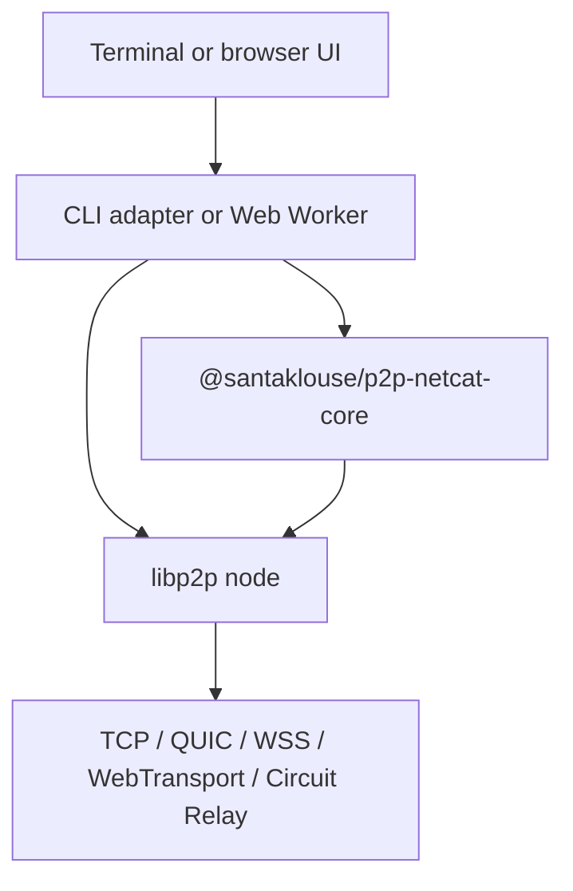

# p2p-netcat architecture and connection algorithm

**English** | [Русский](ARCHITECTURE.RU.md)

This document describes the current implementation of the shared JavaScript
library, CLI, browser PWA, PeerId discovery, route selection, secure channel
setup, and byte-stream handling.

## System model

`p2p-netcat` replaces the usual `IP address + port` pair with:

```text
PeerId + logical port
```

The logical port is mapped to a libp2p protocol ID. For example, `31337`
becomes `/p2p-netcat/1.0.0/31337`. PeerId identifies the cryptographic peer;
a multiaddr describes a currently usable route to that peer. PeerId does not
embed a current IP address, so discovery must still produce at least one
reachable multiaddr.

## Components



The browser-safe core package owns validation, protocol-ID construction,
multiaddr normalization, relay route planning, browser address checks, and
transport ranking. Node creation, DHT access, stdin/stdout, IndexedDB, and
Worker RPC remain in their platform adapters.

The CLI supplies persistent identities, TCP/QUIC, mDNS, Amino DHT, stream
bridging, command execution, and relay-server mode. React owns the browser UI;
all libp2p networking runs in a module Web Worker. The Service Worker only
caches and updates the PWA shell—it does not carry P2P traffic.

## Identity and protocol selection

The listener stores an Ed25519 private key in
`~/.config/p2p-netcat/identity.key`, using `0700` for the directory and `0600`
for the key. The public-key identity produces a stable PeerId. CLI clients use
an ephemeral identity unless `--identity` is supplied; the browser identity is
also currently ephemeral.

The shared library validates logical ports in the `1..65535` range and maps
them to `/p2p-netcat/1.0.0/{port}`. These are service selectors, not operating
system TCP or UDP ports.

## CLI listener algorithm

1. Validate the logical port and load or create the persistent key.
2. Create a libp2p node with QUIC v1, TCP, WebSocket, Circuit Relay v2, Noise,
   Yamux, identify, ping, mDNS, bootstrap discovery, and Amino DHT.
3. Register a handler for the selected p2p-netcat protocol ID.
4. Print PeerId and current multiaddrs to stderr.
5. Publish a provider record for the listener's PeerId CID. Publication has a
   60-second timeout, retries after 5 seconds, and refreshes every 6 hours.
6. Bridge an authenticated inbound stream to stdin/stdout or to the command
   selected by `-e`.
7. Stop after one session, or keep accepting sessions with `-k`.

Provider results are accepted only when the provider ID equals the requested
PeerId. The secure libp2p handshake performs the final identity verification.

## CLI client algorithm

1. A full multiaddr bypasses discovery.
2. With `--relay`, the first configured relay becomes
   `relay/p2p-circuit/p2p/targetPeerId`.
3. Otherwise, the client checks its peer store, which can contain information
   learned through mDNS, bootstrap, identify, or an earlier query.
4. It searches for a provider record of the target PeerId CID, with up to four
   seconds per attempt.
5. It then runs Amino DHT `findPeer`, also with up to four seconds per attempt.
6. The process repeats every 500 ms until `-w`, which defaults to 60 seconds.
7. `dialProtocol()` opens the stream for the selected logical-port protocol.

The shared rank order is WebRTC Direct, QUIC v1, WebTransport, WSS, WS, TCP,
other addresses, then Circuit Relay. Each runtime can use only transports it
actually implements.

## Browser route algorithm

The UI exchanges `start`, `connect`, `send`, `closeWrite`, and `stop` RPC
messages with the Worker. ArrayBuffers are transferred rather than cloned.
The Worker uses WebTransport, WebSocket, Circuit Relay v2, Noise, Yamux,
bootstrap discovery, and Amino DHT client mode.

When the manual relay field is empty:

1. Read the last successful route from IndexedDB. Entries expire after 24
   hours; a cached route gets a six-second dial attempt.
2. Load static `network-config.json`, falling back to an embedded configuration.
3. Query every delegated routing endpoint for both `peers/{PeerId}` and
   `providers/{PeerId-CID}`. Those HTTP requests run concurrently with an
   eight-second timeout each.
4. If delegated routing returns no browser-usable address, query the provider
   record and then `findPeer` through Amino DHT for up to 20 seconds.
5. Keep WebTransport and WS/WSS addresses only. An HTTPS page rejects insecure
   WS; ordinary TCP and Node.js QUIC addresses are not browser-dialable.
6. Add optional WSS relay routes from `network-config.json`.
7. Start `dialProtocol()` for all candidate routes concurrently. `Promise.any`
   selects the first successful stream and AbortControllers cancel the losers.
8. Cache the winning multiaddr in IndexedDB for the next session.

Delegated Routing and DHT are sequential fallback layers. The dial attempts for
the resulting candidate multiaddrs are the parallel part.

If a manual relay is supplied, automatic discovery is skipped. The core package
requires a relay PeerId, WS/WSS transport, and WSS for an HTTPS page, then builds
the final Circuit Relay route.

## Secure channel and data flow

Discovery is a routing aid, not a trust anchor. During the libp2p handshake the
remote peer proves ownership of the target PeerId key. A mismatched identity is
rejected. Direct QUIC uses QUIC TLS 1.3; the configured libp2p connection
encrypter is Noise. Yamux carries the selected logical-port stream.

Application data is an unframed byte stream—there is no JSON envelope or line
protocol. CLI sending and receiving run concurrently and honor backpressure.
EOF closes the write side after the optional `-q` delay while receiving can
continue. The browser reads files as streams and transfers each chunk to the
Worker.

A relay carries the already protected libp2p channel. It can observe PeerIds,
addresses, timing, and volume, but not application bytes. DHT and delegated
routing can observe lookup metadata; the design does not provide anonymity.

## Static browser configuration and PWA

`web/public/network-config.json` contains delegated HTTP Routing V1 endpoints
and an optional WSS relay pool. An empty relay list means no hidden relay is
required by default. The file is a static GitHub Pages asset and is included in
the PWA precache.

The generated Service Worker caches HTML, CSS, JavaScript, the module Worker,
manifest, images, and JSON. Offline startup means the UI shell can open from
cache; route discovery and P2P communication still require network access
unless the peer is locally reachable.

## Operational limits

- PeerId alone cannot guarantee reachability when the peer is offline, has not
  published an address, or is behind NAT without a working relay reservation.
- Browsers cannot dial ordinary TCP or Node.js QUIC multiaddrs.
- WebRTC/Trystero discovery is not yet part of the transport pipeline.
- Public IPFS peers do not guarantee arbitrary Circuit Relay capacity.
- There is no PeerId allowlist or application authorization layer yet.
- Netcat-style UDP datagrams are not implemented; QUIC still carries a reliable
  ordered stream.
- An IPFS HTTP gateway is neither a transport nor a Circuit Relay.

## Source map

| File | Responsibility |
|---|---|
| `packages/core/src/index.js` | Validation, protocol IDs, relay plans, address ranking |
| `src/identity.js` | CLI Ed25519 identity storage |
| `src/node.js` | Node.js libp2p construction |
| `src/discovery.js` | CLI DHT publication and PeerId resolution |
| `src/session.js` | Bidirectional streams, backpressure, and `-e` |
| `src/cli.js` | CLI commands and lifecycle |
| `web/app/p2p-client.ts` | React-to-Worker RPC |
| `web/app/p2p.worker.ts` | Browser libp2p, discovery, route race, and cache |
| `web/public/network-config.json` | Static routing endpoints and relay pool |
| `web/vite.config.ts` | Static build and PWA configuration |

